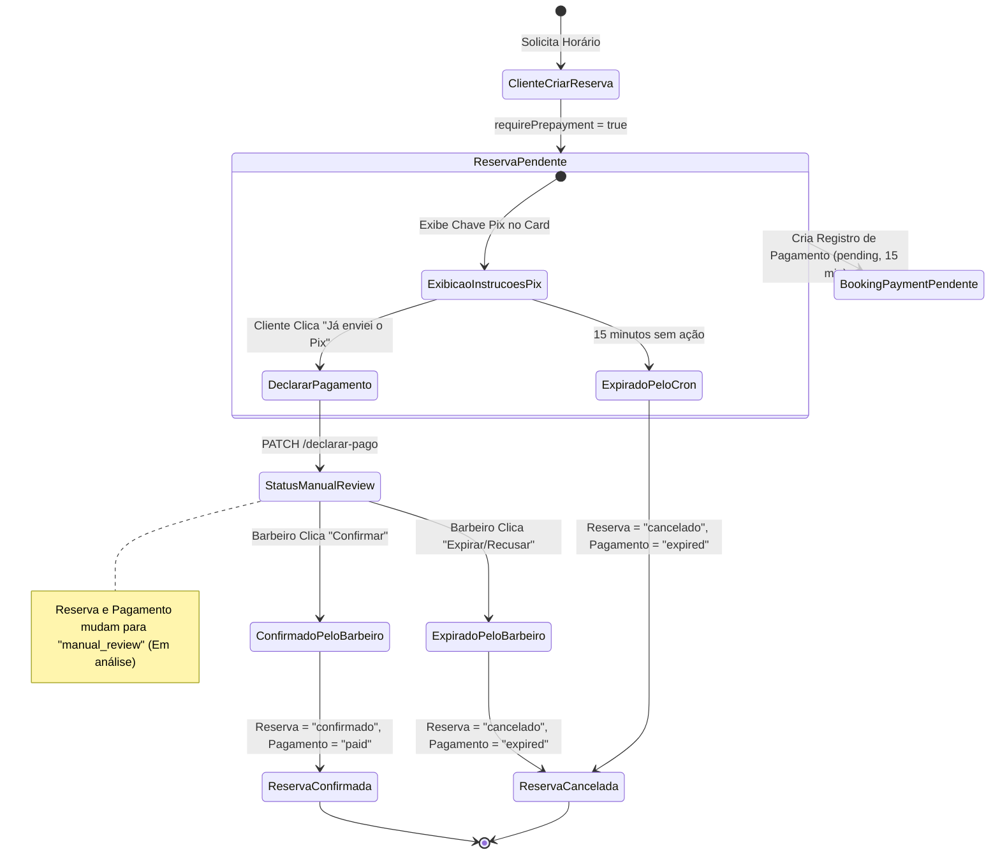

# Auditoria Sistemática de Implementação: Fluxo de Pagamento Pix Manual

Este documento fornece um relatório de auditoria sistemático, profundo e cronológico sobre a engenharia, implementação e validação do fluxo de pagamento manual via Pix no projeto **Doodads**. O objetivo é documentar a arquitetura didaticamente para fins de replicação e conformidade.

---

## 1. Escopo & Motivação Técnica

A barbearia necessitava de um fluxo de controle de reservas que exigisse pré-pagamento sem a complexidade ou dependência de adquirentes/gateways de pagamentos reais num primeiro momento (Stripe/MercadoPago real). 

### Objetivos do Fluxo Manual:
1. **Garantia de Reserva**: Impedir que slots da agenda fossem ocupados de forma indefinida por reservas fantasma.
2. **Transparência na Experiência do Cliente (UX)**: Exibir dados explícitos de chave Pix da barbearia no card do cliente, juntamente com o cronômetro regressivo da janela de expiração (15 minutos).
3. **Declaração Ativa do Cliente ("Já enviei o Pix")**: Fornecer ao cliente um meio de declarar que efetuou a transferência bancária por fora do app.
4. **Controle Manual pelo Estabelecimento**: Dar ao barbeiro o poder de auditar o recebimento no seu próprio extrato bancário externo e confirmar ou expirar o pagamento no painel administrativo do app.

---

## 2. Diagrama de Transição de Estados (Workflow)

Abaixo está o ciclo de vida de uma reserva e do seu respectivo registro de pagamento sob o fluxo manual implementado:



---

## 3. Arquitetura da Implementação (Componentes)

A arquitetura foi implementada de maneira modularizada e desacoplada em três camadas: **Banco de Dados/Modelagem**, **Serviços/Controladores do Servidor (Backend)**, e **Interface do Usuário (Frontend)**.

### A. Camada de Dados (MongoDB / Mongoose)

1. **`BookingPolicy`** ([BookingPolicy.ts](file:///home/leonardomaximinobernardo/My_projects/doodads/server/models/BookingPolicy.ts)): 
   Define as regras de agendamento por barbearia.
   * `requirePrepayment: true`: Ativa a obrigatoriedade de pagamento prévio.
   * `paymentExpirationMinutes: 15`: Janela temporal que o cliente possui para efetuar e declarar o Pix.
2. **`BarbeariaPaymentConfig`** ([BarbeariaPaymentConfig.ts](file:///home/leonardomaximinobernardo/My_projects/doodads/server/models/BarbeariaPaymentConfig.ts)):
   Registra as chaves de recebimento.
   * `paymentMode: "manual_pix"`
   * `provider: "manual"`
   * `pixKeyMasked`: Contém a chave de e-mail mockada da barbearia (ex: `pix@barbeariaestilofino.com.br`).
3. **`BookingPayment`** ([BookingPayment.ts](file:///home/leonardomaximinobernardo/My_projects/doodads/server/models/BookingPayment.ts)):
   Entidade que rastreia a transação de pagamento.
   * `status`: Transiciona entre `"pending"`, `"manual_review"`, `"paid"`, `"expired"`.
4. **`Reserva`** ([Reserva.ts](file:///home/leonardomaximinobernardo/My_projects/doodads/server/models/Reserva.ts)):
   Documento principal de agendamento.
   * `paymentStatus`: Mapeado em sincronia com o status do `BookingPayment` (`"pending"`, `"manual_review"`, `"paid"`, `"expired"`).

---

### B. Camada de Negócio & Rotas (Express / Node.js)

1. **Service (`bookingPaymentManual.service.ts`)**:
   * Métodos cruciais adicionados e estendidos:
     * **`reportManualBookingPayment`**: Executa as checagens de regras de negócio. Valida se o solicitante é o dono do agendamento, se a reserva está com status `pendente` e se a janela de 15 minutos não expirou. Transiciona o status do pagamento e da reserva para `manual_review`.
     * **`confirmManualBookingPayment`**: Processo administrativo que muda o status para `paid` e a reserva para `confirmado`.
     * **`expireManualBookingPayment`**: Processo administrativo (ou temporizado) que transiciona a reserva para `cancelado` e o pagamento para `expired`.
2. **Controller (`bookingPaymentManual.controller.ts`)**:
   * **`declararPagamentoManual`**: Intermedeia a requisição HTTP PATCH e responde com o objeto atualizado de pagamento.
3. **Mapeamento de Rotas (`reserva.routes.ts`)**:
   * Rota registrada para declaração do cliente:
     ```ts
     router.patch(
       "/pagamento-manual/:bookingPaymentId/declarar-pago",
       authMiddleware,
       declararPagamentoManual
     );
     ```

---

### C. Camada de UI (React / Next.js)

* **`AppointmentCard.tsx`** ([AppointmentCard.tsx](file:///home/leonardomaximinobernardo/My_projects/doodads/client/components/ui/AppointmentCard.tsx)):
  * **Exibição Condicional**: Adicionada a verificação para renderizar a caixa informativa azul de instruções apenas se `reserva.status === "pendente"` e `reserva.paymentStatus === "pending"`.
  * **Instruções do Recebimento**: Apresenta a Chave Pix cadastrada na barbearia, favorecido e valor formatado em Real (`R$ 30,00`).
  * **Botão "Já enviei o Pix"**: Adicionado um botão verde destacado que abre um modal de confirmação.
  * **Integração Axios**: Dispara uma requisição HTTP PATCH para o endpoint `/reservas/pagamento-manual/${reserva.bookingPaymentId}/declarar-pago`. Com o sucesso, dispara `onUpdate()` (que aciona o refresh do SWR) mudando instantaneamente o visual para o alerta amarelo "Em análise manual".

---

## 4. Guia Didático de Replicação (Passo a Passo)

Para implementar este mesmo fluxo manual em qualquer outro projeto de agendamento web, siga o seguinte roteiro passo a passo:

### Passo 1: Modelar a tabela de Pagamentos
Crie uma tabela/coleção dedicada a pagamentos com chaves estrangeiras vinculadas à reserva (`bookingId` ou `reservaId`) e um campo enum de `status` contendo pelo menos: `["pending", "manual_review", "paid", "expired"]`.

### Passo 2: Implementar a Rota de Declaração de Pagamento
Disponibilize um endpoint REST do tipo `PATCH` que receba o ID do registro de pagamento, aplique segurança de sessão para verificar se o remetente é o dono da reserva, altere o status para `manual_review` e salve as datas de alteração.

### Passo 3: Criar Interface Informativa de Pagamento
No frontend do cliente, no card de detalhes da reserva ativa/pendente, implemente um bloco de instruções de fácil leitura contendo os dados estáticos ou dinâmicos do Pix da barbearia (chave, tipo de chave, nome do recebedor e valor exato da transação).

### Passo 4: Implementar o Modal de Confirmação do Envio
Impeça cliques acidentais adicionando um modal de duplo clique que exibe mensagens de atenção (ex: *"Atenção: Apenas confirme se o pagamento foi enviado no banco externo. Confirmações falsas acarretarão em cancelamento do horário"*). Quando o usuário clicar em "Confirmar", faça a requisição `PATCH` ao endpoint do Passo 2 e atualize os estados de UI locais para "Em análise".

### Passo 5: Criar Painel Administrativo de Validação
No frontend do barbeiro/administrador, renderize uma lista com filtros baseados no status `manual_review`. Para cada card nessa aba, disponibilize botões dedicados de **"Confirmar recebimento"** (que transiciona a transação para `paid` e a reserva para `confirmado`) e **"Recusar/Expirar"** (que cancela a reserva e transiciona o pagamento para `expired`).
