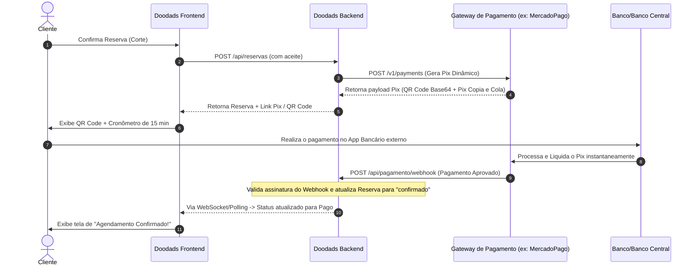

# Plano de Ação: Implementação de Pix Real Dinâmico (QR Code & Webhooks)

Este plano descreve a arquitetura e as etapas necessárias para substituir ou estender o fluxo Pix Manual por uma integração comercial de **Pix Real Dinâmico** utilizando um provedor de pagamentos (como Mercado Pago, Asaas, EFI/Gerencianet ou Banco Inter), de forma assíncrona e segura.

---

## 1. Arquitetura do Fluxo Real (API + Webhook)

Substitui-se a declaração manual do cliente por uma verificação por **notificação instantânea (Webhooks)** enviada pelo provedor de pagamento.

---

## 2. Adaptação do Modelo de Dados

Para acomodar o Pix real dinâmico, as seguintes colunas e metadados devem ser estendidos nos schemas do banco de dados:

### A. Extensões no Schema `BookingPayment`:
* `providerPaymentId`: String (ID único da transação gerado no gateway, para conciliação).
* `pixQrCodeBase64`: String (Imagem do QR code em formato Base64 para exibição rápida).
* `pixCopiaECola`: String (Texto do código copia e cola para smartphones).
* `gatewayResponse`: Schema.Types.Mixed (Payload completo retornado pelo provedor para fins de auditoria de segurança).

### B. Extensões em `BarbeariaPaymentConfig`:
Permite configurar as credenciais reais do estabelecimento:
* `credentialRef`: String (API Key, Client ID ou token de autenticação real criptografado).
* `pixKeyReal`: String (Chave Pix real para registro do payload no gateway).
* `webhookSecretRef`: String (Chave secreta para validação de integridade do webhook do gateway).

---

## 3. Plano de Ação Passo a Passo

### Fase 1: Credenciamento e Infraestrutura de Segurança
1. **Escolha do Provedor**: Recomendado **Mercado Pago** ou **Asaas** pela facilidade de criação de contas Sandbox (ambiente de testes) e homologação rápida de credenciais Pix (chaves API).
2. **Segurança de Webhooks**: Definir endpoint de entrada `/api/pagamento/webhook`. Implementar verificação de assinatura criptográfica nos headers (ex: HMAC-SHA256) fornecidos pelo gateway para rejeitar requisições forjadas.

### Fase 2: Implementação no Servidor (Backend)
1. **Integração do SDK/API do Provedor**:
   * Criar um client HTTP (ex: Axios ou SDK do provedor) que se autentique usando as chaves configuradas em `BarbeariaPaymentConfig`.
2. **Geração do Pix**:
   * No serviço de reserva, ao criar uma reserva com `requirePrepayment = true`, o servidor executa a chamada POST na API do Provedor solicitando a geração do Pix com o valor total da reserva e validade de 15 minutos.
   * Salva o QR Code retornado e o `providerPaymentId` no banco `BookingPayment`.
3. **Controlador do Webhook (`webhookController`)**:
   * O gateway enviará um POST contendo `{ action: "payment.updated", data: { id: "payment_id" } }`.
   * O servidor busca a transação no gateway para verificar se o status real é `"approved"`.
   * Se aprovado, chama internamente `confirmManualBookingPayment` para marcar como pago e confirmar o horário.

### Fase 3: Adaptação do Frontend (Cliente)
1. **Apresentação do QR Code**:
   * No lugar dos dados de texto Pix estáticos em `AppointmentCard.tsx`, exibir a imagem gerada em Base64 do QR Code dinâmico.
   * Exibir o botão **"Copiar código Pix"** que joga o texto do campo `pixCopiaECola` na área de transferência do celular/computador.
2. **Atualização em Tempo Real (UX Premium)**:
   * **Opção 1 (Simples)**: O card do cliente realiza uma busca periódica (polling) de 10 em 10 segundos no endpoint da reserva enquanto o card estiver aberto.
   * **Opção 2 (Avançada/Premium)**: Utilizar WebSockets (Socket.io) para enviar uma notificação do servidor para o cliente informando que a reserva foi confirmada pelo webhook, fechando o modal do Pix automaticamente.

### Fase 4: Política de Contingência (Manual Fallback)
* Manter no painel do barbeiro a possibilidade de **confirmar manualmente** o recebimento. Isso é crucial caso o webhook do gateway falhe devido a indisponibilidades temporárias da internet ou problemas no próprio gateway.
