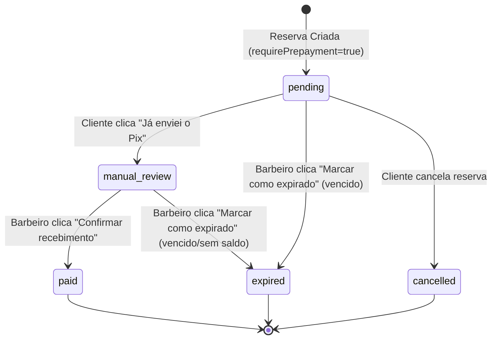

# Baseline de Release — Pagamento Manual Governado — Doodads

Este documento estabelece a baseline oficial de release readiness para o fluxo manual de reservas e pagamentos governados no Doodads. Define o escopo operacional validado, as fronteiras de segurança, as limitações conhecidas e os limites contra futuras integrações financeiras.

---

## 1. Estado Atual Validado

O sistema Doodads opera em modo **Pagamento Manual por Fora (Direct-to-Barbershop)**. O fluxo foi limpo de códigos legados da antiga simulação automatizada e consolidado com as políticas de agendamento (BookingPolicy) e aceitação de termos (TermsAcceptance). 

### Princípio Financeiro Inegociável (Não Custódia)
- **O Doodads não recebe, custodia, processa, divide ou repassa dinheiro.**
- Não há gateway financeiro, chaves Pix dinâmicas, Pix copia-e-cola gerado por API nem webhooks Pix ativos na aplicação.
- Toda a liquidação financeira ocorre externamente entre o cliente e a barbearia, via PIX ou outro método combinado.
- O sistema Doodads atua apenas no registro dos estados lógicos da fatura (`BookingPayment`) e da reserva (`Reserva`).

---

## 2. Fluxos Suportados

1. **Criação de Reserva Fresh com Pré-pagamento Obrigatório**:
   - A barbearia possui `BookingPolicy.requirePrepayment = true`.
   - O cliente aceita os termos obrigatórios (gerando um snapshot de `TermsAcceptance`).
   - A reserva nasce com `status = "pendente"`, `paymentRequired = true` e `paymentStatus = "pending"`.
   - É gerado um documento `BookingPayment` em estado `pending` com prazo de expiração de 15 minutos (ou tempo definido pela policy).
2. **Declaração de Envio (Cliente)**:
   - O cliente, após efetuar a transferência Pix externa diretamente para a chave da barbearia, clica em "Já enviei o Pix".
   - O `BookingPayment.status` e `Reserva.paymentStatus` transitam para `"manual_review"` ("Em análise manual").
3. **Confirmação de Recebimento (Barbeiro)**:
   - O barbeiro/proprietário consulta seu saldo bancário diretamente no aplicativo do seu banco.
   - Ao confirmar a liquidação, clica em "Confirmar recebimento" no painel.
   - O `BookingPayment` transita para `"paid"` e a reserva muda para `status = "confirmado"` e `paymentStatus = "paid"`.
4. **Expiração Manual (Barbeiro)**:
   - Caso o prazo de 15 minutos expire sem o cliente declarar o envio, ou caso a análise manual revele fraude (não liquidação bancária), o barbeiro pode clicar em "Marcar como expirado".
   - O `BookingPayment` muda para `"expired"`, a reserva muda para `status = "cancelado"` e `paymentStatus = "expired"`.
5. **Cancelamento do Cliente**:
   - O cliente pode cancelar reservas futuras pendentes. O status do `BookingPayment` é propagado para `"cancelled"`.

---

## 3. Fluxos Não Suportados (Fora de Escopo)

- ❌ Integração de Pix real (sem geração de QR Code, sem chaves Pix no banco, sem webhook ativo de banco).
- ❌ Envio de comprovante por upload de arquivo ou OCR.
- ❌ Estornos automáticos no banco em caso de cancelamento.
- ❌ Custódia ou contas virtuais integradas.
- ❌ Integração Stripe ou split de pagamentos ativa.

---

## 4. Estados e Transições Validados

### Estados de Reserva (`Reserva.status`)
- `"pendente"`: Reserva criada, aguardando confirmação ou pagamento.
- `"confirmado"`: Reserva ativa com pagamento confirmado pelo barbeiro.
- `"cancelado"`: Reserva cancelada por limite de tempo, expiração ou iniciativa do usuário.

### Estados de Pagamento (`Reserva.paymentStatus` / `BookingPayment.status`)
- `"pending"`: Fatura manual criada, aguardando declaração do cliente.
- `"manual_review"`: Cliente declarou envio ("Já enviei o Pix"); aguardando conferência humana do barbeiro.
- `"paid"`: Recebimento confirmado pelo barbeiro após conferência externa.
- `"expired"`: Marcado pelo barbeiro como expirado após o prazo.
- `"cancelled"`: Propagado após cancelamento de reserva pelo cliente.

---

## 5. Bloqueios e Regras de Negócio Validadas

- **Bloqueio de Cancelamento de Reserva Paga**: O cliente não pode cancelar pelo aplicativo uma reserva que já possua `paymentStatus = "paid"`. O backend lança `ALREADY_PAID_CANCEL` (HTTP 400), obrigando o cliente a entrar em contato com o suporte para acerto manual de cancelamento/estorno.
- **UX Temporal (Reserva Passada)**: O cliente não pode cancelar reservas cujo horário do agendamento já ocorreu. O backend lança `ALREADY_OCCURRED` (HTTP 400) e o frontend oculta o botão de cancelamento, exibindo o badge "Horário já passou".
- **Cutoff de Cancelamento**: Tentativas de cancelamento dentro da janela restrita (ex: menos de 60 minutos) por clientes não privilegiados são bloqueadas com o erro `TOO_LATE`.
- **404 para Rota Legada**: O endpoint de simulação de pagamento automatizado `PATCH /api/reservas/:id/pagar` foi completamente extinto e retorna HTTP 404.

---

## 6. Riscos Residuais e Limitações Conhecidas

1. **Risco de Declaração Falsa**: O cliente pode clicar em "Já enviei o Pix" sem ter efetuado a transferência. O barbeiro deve ser explicitamente educado pelo aplicativo a verificar o saldo real do seu banco antes de clicar em "Confirmar recebimento".
2. **Expiração Manual Obrigatória**: Não há rotinas automáticas de segundo plano (CRON/schedulers) rodando para expirar reservas vencidas no banco de forma silenciosa. A transição para `expired` depende da ação de expiração manual do barbeiro através do dashboard ou da expiração durante listagem.
3. **Valores mock no Seed**: O script de população de banco local (`populateDataBaseSeed.ts`) cria reservas fictícias nos estados `pending` e `paid` para facilitação do ambiente local, sem acionar rotas externas.

---

## 7. Fronteira com Pix Real Futuro

Quando for iniciada a fase de Pix real integrado (gerado por APIs de providers), a arquitetura do Doodads deverá respeitar estritamente a modelagem de BookingPayment atual:
- O Doodads continuará operando sob o princípio de não receber nem custodiar dinheiro (a chave Pix e a conta bancária vinculada ao QR Code serão exclusivas da barbearia de destino, com o provider transferindo diretamente para o recebedor final).
- Os campos estruturais preparados (`pixQrCodeRef`, `providerPaymentId`, `webhookEventId`) serão ativados apenas nesse momento, permanecendo vazios/inativos na atual release baseline.
