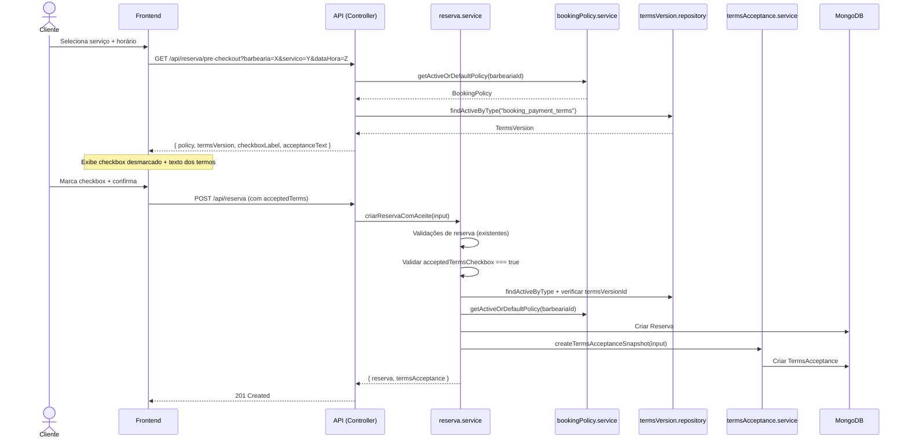

# Especificação: Integração de TermsAcceptance ao Fluxo de Reserva — Phase C3

## 1. Objetivo

Especificar a integração futura de TermsAcceptance ao fluxo de criação de reserva, definindo contrato de API, validações, snapshots, threat model, LGPD/CDC, testes exigidos e critérios GO/NO-GO — **sem implementar nenhuma alteração funcional nesta fase**.

## 2. Estado Atual (Pré-Phase C3)

| Componente | Estado | Localização |
|---|---|---|
| TermsVersion model | ✅ Implementado | `server/models/TermsVersion.ts` |
| TermsVersion seed service | ✅ Implementado | `server/services/termsVersionSeed.service.ts` |
| TermsVersion repository | ✅ Implementado | `server/repositories/termsVersion.repository.ts` |
| TermsAcceptance model | ✅ Implementado | `server/models/TermsAcceptance.ts` |
| TermsAcceptance service | ✅ Implementado | `server/services/termsAcceptance.service.ts` |
| TermsAcceptance repository | ✅ Implementado | `server/repositories/termsAcceptance.repository.ts` |
| BookingPolicy model + service | ✅ Implementado | `server/models/BookingPolicy.ts`, `server/services/bookingPolicy.service.ts` |
| Reserva model | ✅ Implementado | `server/models/Reserva.ts` — **sem campo termsAcceptanceId** |
| Reserva service | ✅ Implementado | `server/services/reserva.service.ts` — **sem integração com TermsAcceptance** |
| Reserva controller | ✅ Implementado | `server/controllers/reserva.controller.ts` — **sem checkbox/aceite** |
| Integração TermsAcceptance ↔ Reserva | ❌ Não implementado | — |
| Frontend de aceite | ❌ Não implementado | — |
| Pix real / webhook / QR real | ❌ Não implementado | — |

**Main**: 92 testes em 8 suítes, TypeScript sem erros, auditorias limpas.

## 3. Fora de Escopo desta Especificação

- Implementação funcional de qualquer componente.
- Alteração de código em qualquer service, controller, model, route ou frontend.
- Ativação de Pix real, webhook, QR real, provider real ou payment_pending.

---

## 4. Fluxo Futuro Proposto



### Sequência detalhada

1. **Pré-checkout** (opcional, nova rota GET futura): o frontend solicita a BookingPolicy e a TermsVersion vigentes para a barbearia, recebendo checkbox label e texto de aceite já formatados pelo backend.

2. **Criação de reserva** (POST existente, ampliado): o frontend envia os dados de reserva + flag de aceite + termsVersionId. O backend:
   - Executa todas as validações de reserva existentes (barbearia, serviço, data, conflito).
   - Valida que `acceptedTermsCheckbox === true`.
   - Valida que `termsVersionId` existe e está ativo.
   - Resolve BookingPolicy da barbearia.
   - Cria a Reserva.
   - Cria o TermsAcceptance com snapshot completo (via `termsAcceptanceService.createTermsAcceptanceSnapshot`).
   - Retorna reserva + confirmação de aceite.

3. **Fluxo antigo preservado**: reservas criadas antes da ativação do aceite continuam funcionando normalmente. O aceite pode ser opcional numa flag de feature, tornando-se obrigatório apenas quando configurado.

---

## 5. Contrato Futuro de Entrada (Request)

### POST `/api/reserva` (ampliado)

```typescript
// Campos EXISTENTES (não alterar)
{
  barbearia: string;       // ObjectId
  servico: string;         // ObjectId
  dataHora: string;        // ISO 8601
  valor?: number;          // em reais (existente)

  // Campos NOVOS para aceite (fase futura)
  acceptedTerms?: {
    termsVersionId: string;          // ObjectId da TermsVersion aceita
    acceptedTermsCheckbox: boolean;  // Deve ser explicitamente true
    locale?: string;                 // ex: "pt-BR"
    source: "web" | "mobile" | "admin";
  }
}
```

### Regras de entrada

| Campo | Obrigatório | Regra |
|---|---|---|
| `acceptedTerms` | Condicional* | Obrigatório quando feature flag `requireTermsAcceptance` estiver ativa |
| `acceptedTerms.termsVersionId` | Sim (se acceptedTerms presente) | Deve ser ObjectId válido de TermsVersion ativa |
| `acceptedTerms.acceptedTermsCheckbox` | Sim (se acceptedTerms presente) | Deve ser `true` explicitamente |
| `acceptedTerms.locale` | Não | Default: `"pt-BR"` |
| `acceptedTerms.source` | Sim (se acceptedTerms presente) | Enum: `web`, `mobile`, `admin` |

\* A transição será gradual: inicialmente opcional, depois obrigatória por feature flag.

---

## 6. Contrato Futuro de Saída (Response)

### 201 Created (sucesso)

```typescript
{
  message: "Reserva criada com sucesso!",
  reserva: { /* IReserva existente */ },
  termsAcceptance?: {
    id: string;
    termsVersionId: string;
    acceptedAt: string;  // ISO 8601
    checkboxLabelSnapshot: string;
  }
}
```

### Erros (4xx)

Ver seção 8 — Matriz de Erros.

---

## 7. Campos Server-Owned (nunca enviados pelo cliente)

O **backend** é responsável por montar os seguintes campos a partir de dados confiáveis do servidor. O cliente **nunca** envia esses valores:

| Campo | Fonte |
|---|---|
| `reservaId` | Gerado após criação da reserva |
| `barbeariaId` | Extraído de `req.body.barbearia` (já validado) |
| `userId` | Extraído de `req.user.id` (JWT) |
| `acceptedAt` | `new Date()` no servidor |
| `checkboxLabelSnapshot` | Gerado pelo backend a partir do TermsVersion |
| `acceptanceTextSnapshot` | Gerado pelo backend a partir do TermsVersion |
| `serviceSnapshot.servicoNome` | Buscado do model Servico |
| `serviceSnapshot.priceCents` | Calculado do Servico.preco × 100 |
| `serviceSnapshot.scheduledAt` | `dataHora` validada |
| `serviceSnapshot.durationMinutes` | Servico.duracaoMin |
| `serviceSnapshot.arrivalToleranceMinutes` | BookingPolicy.arrivalToleranceMinutes |
| `serviceSnapshot.paymentExpirationMinutes` | BookingPolicy.paymentExpirationMinutes |
| `serviceSnapshot.cancellationWindowHours` | BookingPolicy.cancellationWindowHours |
| `serviceSnapshot.refundPolicySummary` | Derivado de BookingPolicy.refundPolicy |
| `serviceSnapshot.noShowPolicySummary` | Derivado de BookingPolicy.noShowPolicy |
| `clientIpHash` | SHA-256 de `req.ip` |
| `userAgentHash` | SHA-256 de `req.headers['user-agent']` |

**Regra de ouro**: o cliente envia apenas `termsVersionId`, `acceptedTermsCheckbox`, `locale` e `source`. Todo o restante é montado pelo backend a partir de fontes confiáveis.

---

## 8. Matriz de Erros HTTP Futura

| HTTP | Código | Condição |
|---|---|---|
| 400 | `TERMS_ACCEPTANCE_REQUIRED` | `acceptedTerms` ausente quando feature flag ativa |
| 400 | `TERMS_CHECKBOX_NOT_ACCEPTED` | `acceptedTermsCheckbox !== true` |
| 400 | `TERMS_VERSION_INVALID` | `termsVersionId` não é ObjectId válido |
| 404 | `TERMS_VERSION_NOT_FOUND` | TermsVersion não encontrada no banco |
| 409 | `TERMS_VERSION_INACTIVE` | TermsVersion existe mas `isActive === false` |
| 400 | `TERMS_VERSION_TYPE_MISMATCH` | TermsVersion não é do tipo `booking_payment_terms` |
| 404 | `BOOKING_POLICY_NOT_FOUND` | BookingPolicy não encontrada (improvável com default) |
| 400 | `SNAPSHOT_TEXT_EMPTY` | checkboxLabelSnapshot ou acceptanceTextSnapshot gerado vazio |
| 400 | `INVALID_SOURCE` | source fora do enum `web|mobile|admin` |
| 422 | `SERVER_OWNED_FIELD_REJECTED` | Cliente tentou enviar campo server-owned (mass assignment) |

---

## 9. Estratégia de Snapshot

### Princípio

O snapshot congela o estado exato do serviço e das políticas **no momento do aceite**, garantindo auditabilidade mesmo se termos ou políticas mudarem depois.

### Campos congelados

| Categoria | Campos | Fonte |
|---|---|---|
| Texto de aceite | checkboxLabelSnapshot, acceptanceTextSnapshot | TermsVersion.title + TermsVersion.content |
| Serviço | servicoNome, priceCents, scheduledAt, durationMinutes | Servico + dataHora |
| Política | arrivalToleranceMinutes, paymentExpirationMinutes, cancellationWindowHours, refundPolicySummary, noShowPolicySummary | BookingPolicy |

### Geração do checkboxLabelSnapshot

```
"Li e aceito os {TermsVersion.title} (versão {TermsVersion.version})."
```

### Geração do acceptanceTextSnapshot

```
TermsVersion.content  // conteúdo integral dos termos vigentes
```

---

## 10. Estratégia LGPD / Minimização de Dados

| Dado | Tratamento | Justificativa |
|---|---|---|
| IP do cliente | SHA-256 com domínio `client_ip` | Minimização: permite verificação sem armazenar IP puro |
| User-Agent | SHA-256 com domínio `user_agent` | Minimização: permite verificação sem armazenar UA puro |
| Nome do cliente | Não armazenado no TermsAcceptance | Apenas `userId` (ObjectId) referencia o User |
| Dados de pagamento | Não armazenados nesta fase | Sem Pix real/Stripe ativo |
| Termos aceitos | Snapshot integral | Necessário para comprovação de aceite conforme CDC |

### Conformidade CDC (Código de Defesa do Consumidor)

- Art. 46: o consumidor não é obrigado por cláusulas não apresentadas previamente. O snapshot garante que o texto aceito foi apresentado.
- Art. 49: direito de arrependimento em 7 dias para compras online. O snapshot congela o contexto para eventual análise.
- Art. 6, III: informação adequada e clara. O checkbox label deve ser legível e explícito.

### Conformidade LGPD

- Art. 6, I (finalidade): dados de aceite coletados exclusivamente para comprovar consentimento.
- Art. 6, III (necessidade): coleta limitada ao mínimo necessário — IP/UA são hasheados, não armazenados puros.
- Art. 7, I (consentimento): o aceite é registrado com snapshot do texto apresentado.

---

## 11. Threat Model Mínimo

| Ameaça | Risco | Mitigação |
|---|---|---|
| **Manipulação de termsVersionId** | Cliente envia ID de TermsVersion inativa ou de tipo incorreto para burlar aceite | Backend valida existência, `isActive` e `type === "booking_payment_terms"` |
| **Replay de aceite** | Cliente reenvia aceite anterior para reserva diferente | Cada TermsAcceptance é vinculado a `reservaId` específico; criado atomicamente com a reserva |
| **Aceite sem checkbox** | Cliente envia `acceptedTermsCheckbox: false` ou omite campo | Backend exige `=== true` explícito; falsy rejeita |
| **Divergência texto exibido vs persistido** | Frontend exibe texto A, mas backend persiste texto B | Backend gera snapshot a partir do TermsVersion oficial; cliente não controla o texto persistido |
| **Vazamento de IP/User-Agent** | IP/UA armazenados em texto puro violam LGPD | Hashing SHA-256 com domínio; nunca persiste raw; auditado por testes e grep |
| **Alteração retroativa de termos** | Admin altera TermsVersion após aceite para negar responsabilidade | Snapshot congela conteúdo no momento do aceite; `contentHash` garante integridade |
| **Mass assignment** | Cliente envia `checkboxLabelSnapshot`, `serviceSnapshot` ou `clientIpHash` diretamente | Campos server-owned são ignorados/rejeitados; backend monta a partir de fontes confiáveis |
| **Falsificação de source** | Cliente envia `source: "admin"` sendo web | Validação contra enum; em fase futura, cross-check com middleware de autenticação |
| **Omissão de aceite em reserva paga** | Reserva com pagamento futuro sem TermsAcceptance | Feature flag torna aceite obrigatório antes de qualquer transação financeira |

---

## 12. Impacto Futuro Esperado em Services/Models/Controllers

### 12.1. Reserva.ts (model)

**Alteração necessária em fase futura**: adicionar campo opcional `termsAcceptanceId`.

```typescript
// Adição futura ao IReserva:
termsAcceptanceId?: Types.ObjectId;

// Adição futura ao ReservaSchema:
termsAcceptanceId: { type: Schema.Types.ObjectId, ref: "TermsAcceptance", index: true }
```

**Justificativa**: permite consulta reversa — dado uma reserva, encontrar o aceite associado. O campo é opcional para preservar retrocompatibilidade com reservas criadas antes da ativação.

**Quando alterar**: somente na fase de implementação, após esta spec ser aprovada.

### 12.2. reserva.service.ts

**Alteração necessária em fase futura**: ampliar `criarReserva` ou criar `criarReservaComAceite`.

Opção recomendada: **criar método separado `criarReservaComAceite`** para evitar regressão no fluxo existente.

```typescript
async criarReservaComAceite(
  usuarioId: string,
  barbearia: string,
  servico: string,
  dataHora: string,
  valor: number | undefined,
  acceptedTerms: { termsVersionId: string; acceptedTermsCheckbox: boolean; locale?: string; source: "web" | "mobile" | "admin" },
  clientIp?: string,
  userAgent?: string
): Promise<{ reserva: IReserva; termsAcceptance: ITermsAcceptance }>
```

**Sequência interna**:
1. Todas as validações existentes de `criarReserva`.
2. Validar `acceptedTermsCheckbox === true`.
3. Buscar TermsVersion por ID, validar ativa e tipo correto.
4. Buscar BookingPolicy (getActiveOrDefaultPolicy).
5. Buscar Servico para snapshot.
6. Criar Reserva.
7. Criar TermsAcceptance snapshot com dados server-owned.
8. Opcionalmente: atualizar `reserva.termsAcceptanceId`.
9. Retornar ambos.

### 12.3. reserva.controller.ts

**Alteração necessária em fase futura**: ampliar `criarReserva` para extrair `acceptedTerms` de `req.body` e `clientIp`/`userAgent` de `req`.

```typescript
const { barbearia, servico, dataHora, valor, acceptedTerms } = req.body;
const clientIp = req.ip;
const userAgent = req.headers['user-agent'];
```

### 12.4. Rotas

**Alteração necessária em fase futura**: opcionalmente, criar rota GET de pré-checkout.

```
GET /api/reserva/pre-checkout?barbearia=X&servico=Y
```

A rota POST existente permanece a mesma; apenas o body é ampliado.

---

## 13. Testes Exigidos para a Fase de Implementação

### 13.1. Testes unitários

| Teste | Descrição |
|---|---|
| Geração de checkboxLabelSnapshot | Formato correto a partir do TermsVersion |
| Geração de acceptanceTextSnapshot | Conteúdo integral do TermsVersion.content |
| Montagem de serviceSnapshot | Todos os campos preenchidos corretamente a partir de Servico + BookingPolicy |
| Conversão preco → priceCents | R$ 50.00 → 5000 centavos |

### 13.2. Testes de service

| Teste | Descrição |
|---|---|
| criarReservaComAceite com input válido | Cria reserva + TermsAcceptance |
| Rejeição de checkbox false | Erro TERMS_CHECKBOX_NOT_ACCEPTED |
| Rejeição de termsVersionId inativo | Erro TERMS_VERSION_INACTIVE |
| Rejeição de termsVersionId inexistente | Erro TERMS_VERSION_NOT_FOUND |
| Rejeição de type incorreto | Erro TERMS_VERSION_TYPE_MISMATCH |
| Aceite sem userId (convidado) | Cria corretamente sem userId |
| Snapshot preserva dados corretos | Verificação campo a campo do serviceSnapshot |

### 13.3. Testes de contrato

| Teste | Descrição |
|---|---|
| POST /api/reserva com acceptedTerms | 201 com termsAcceptance na resposta |
| POST /api/reserva sem acceptedTerms (feature off) | 201 normal (retrocompatível) |
| POST /api/reserva sem acceptedTerms (feature on) | 400 TERMS_ACCEPTANCE_REQUIRED |
| POST com checkbox false | 400 TERMS_CHECKBOX_NOT_ACCEPTED |
| POST com termsVersionId inválido | 400/404 |

### 13.4. Testes de regressão

| Teste | Descrição |
|---|---|
| Fluxo antigo sem acceptedTerms | Continua funcionando quando feature off |
| Cancelamento de reserva com aceite | Não altera TermsAcceptance |
| Consulta de reserva inclui termsAcceptanceId | Quando populado |

### 13.5. Testes contra mass assignment

| Teste | Descrição |
|---|---|
| Cliente envia checkboxLabelSnapshot | Campo ignorado, backend gera o próprio |
| Cliente envia serviceSnapshot | Campo ignorado, backend gera o próprio |
| Cliente envia clientIpHash | Campo ignorado, backend hasheia do req.ip |
| Cliente envia acceptedAt | Campo ignorado, backend usa new Date() |

### 13.6. Testes de minimização LGPD

| Teste | Descrição |
|---|---|
| IP nunca no documento | JSON.stringify não contém IP puro |
| User-Agent nunca no documento | JSON.stringify não contém UA puro |
| Hash recalculável | hash(req.ip) === doc.clientIpHash |

---

## 14. Critérios GO/NO-GO para Implementação

### GO — Requisitos para avançar para implementação

| # | Critério | Justificativa |
|---|---|---|
| 1 | Esta spec 051 aprovada e mergeada | Base documental validada |
| 2 | Seed de TermsVersion executada com termos ativos | Necessário para lookup em runtime |
| 3 | termsAcceptance.service.ts validado com 92 testes verdes | Fundação sólida |
| 4 | BookingPolicy default funcional | Necessário para gerar snapshot de política |
| 5 | Nenhum Pix real, webhook, QR ou provider implementado | Escopo contido |
| 6 | Feature flag planejada para ativação gradual | Sem impacto em fluxo legado |
| 7 | Testes de regressão para fluxo antigo planejados | Sem quebra de funcionalidade existente |

### NO-GO — Condições que bloqueiam

| # | Condição | Justificativa |
|---|---|---|
| 1 | Alteração de Reserva.ts sem testes de regressão | Risco de quebra do fluxo existente |
| 2 | Pix real ativo sem TermsAcceptance obrigatório | Transação financeira sem consentimento documentado |
| 3 | Frontend sem checkbox desmarcado por padrão | Violação de dark patterns / CDC |
| 4 | Snapshot montado com dados do cliente | Vulnerabilidade de mass assignment |
| 5 | IP/User-Agent persistidos em texto puro | Violação LGPD |
| 6 | Testes abaixo de 90% de cobertura nos novos caminhos | Risco de regressão |

---

## 15. Decisão

DECISÃO: PHASE C3 SPEC CONCLUÍDA COM CONTRATO FUTURO PARA INTEGRAÇÃO DE TERMSACCEPTANCE AO FLUXO DE RESERVA, SEM IMPLEMENTAÇÃO FUNCIONAL, SEM FRONTEND, SEM ROTAS, SEM ALTERAÇÃO DE RESERVA.TS, SEM PAYMENT_PENDING, SEM PIX REAL, WEBHOOK, QR REAL OU PROVIDER REAL. TESTES, TYPESCRIPT E AUDITORIAS PERMANECEM VERDES.

## 16. Próxima Fase Recomendada

DOODADS-TERMS-ACCEPTANCE-BOOKING-FLOW-PHASE-C3-PR-REVIEW-MERGE — Revisar e mergear esta spec na main, validando que nenhuma alteração funcional foi introduzida.
