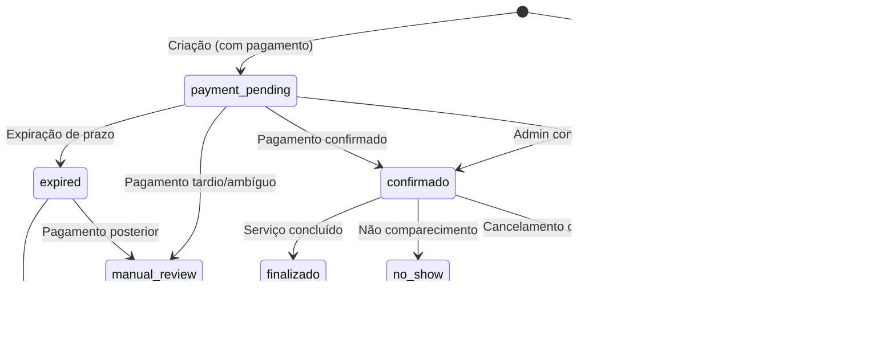

# Phase D0: Especificação do Fluxo Manual Pix Controlado — Relatório 057

## 1. Objetivo

Definir de forma completa e operacional o fluxo futuro de manual_pix para reservas no Doodads, cobrindo estados, transições, contratos de API, autorização, mass assignment, expiração, compliance, separação financeira, threat model, testes obrigatórios e critérios GO/NO-GO — tudo sem implementar código funcional nesta fase.

## 2. Estado Atual da Main

| Item | Valor |
|---|---|
| Testes | 10 suítes, 146 testes verdes |
| TypeScript | 0 erros |
| Models existentes | Reserva, BookingPayment, BookingPolicy, BarbeariaPaymentConfig, TermsVersion, TermsAcceptance |
| Services | reserva.service (criarReserva + criarReservaComAceite), bookingPolicy.service, termsAcceptance.service, termsVersionSeed.service |
| Schema Zod | criarReservaSchema com acceptedTerms .strict() opcional |
| Phases completas | C (TermsVersion seed), C2 (TermsAcceptance snapshot), C3 (spec booking flow), C4 (backend integration), C5 (contract hardening) |
| payment_pending | ❌ Não ativo |
| Pix real | ❌ Não implementado |

## 3. Fora de Escopo desta Fase

- Alteração de código funcional
- Alteração de Reserva.ts, services, controllers, routes, schemas
- Frontend, UI, checkbox visual
- payment_pending ativo
- Pix real, webhook, QR Code, provider
- Credenciais, .env, cobrança real
- SaaS billing, Fundo de Impacto, Stripe Connect, split

## 4. Premissas

1. **manual_pix** = a barbearia recebe Pix diretamente do cliente (fora do Doodads ou via dado mascarado). Doodads **apenas registra** o estado operacional.
2. **Não há intermediação financeira**: Doodads não recebe, processa ou retém dinheiro do cliente.
3. **Não há provider Pix real**: nenhum QR dinâmico, webhook ou integração bancária.
4. **Confirmação é manual**: a barbearia (ou admin) confirma manualmente que recebeu o pagamento.
5. **BookingPolicy.requirePrepayment** determina se a reserva exige pagamento.
6. **BarbeariaPaymentConfig.paymentMode = "manual_pix"** identifica a modalidade.

---

## 5. Fluxo Futuro Manual Pix

### 5.1 Diagrama de Sequência

```
Cliente                     Doodads Backend                  Barbearia
  │                              │                              │
  ├─ POST /reservas ────────────►│                              │
  │  (acceptedTerms + dados)     │                              │
  │                              ├─ Verifica BookingPolicy      │
  │                              ├─ requirePrepayment? ─────────┤
  │                              │   Se false → fluxo antigo    │
  │                              │   Se true → payment_pending  │
  │                              ├─ Cria Reserva (pendente)     │
  │                              ├─ Cria BookingPayment (pending)│
  │                              ├─ Cria TermsAcceptance        │
  │                              ├─ Retorna instrução mascarada │
  │◄─────────────────────────────┤                              │
  │                              │                              │
  │  (paga Pix fora do Doodads) │                              │
  │─────────────────────────────────────────────────────────────►│
  │                              │                              │
  │                              │◄─ PATCH confirmar pagamento ─┤
  │                              ├─ BookingPayment → paid       │
  │                              ├─ Reserva → confirmado        │
  │                              ├─ Notifica cliente            │
  │◄─────────────────────────────┤                              │
```

### 5.2 Fluxo Detalhado

1. **Cliente** envia `POST /reservas` com `acceptedTerms` válido.
2. **Backend** verifica `BookingPolicy.requirePrepayment` para a barbearia.
3. **Se `requirePrepayment = false`**: fluxo antigo — reserva criada como `pendente`, sem `BookingPayment`. Retrocompatibilidade total.
4. **Se `requirePrepayment = true`**:
   a. Backend verifica `BarbeariaPaymentConfig` ativa para a barbearia.
   b. Se `paymentMode = "manual_pix"` e `status = "active"`:
      - Cria `Reserva` com `status: "pendente"`, `paymentStatus: "payment_pending"`.
      - Cria `BookingPayment` com `provider: "manual"`, `status: "pending"`, `amountCents` do serviço.
      - Cria `TermsAcceptance` com snapshot.
      - Define `expiresAt` baseado em `BookingPolicy.paymentExpirationMinutes`.
      - Retorna instrução de pagamento (sem chave Pix real exposta).
   c. Se config não encontrada/inativa: rejeita com erro.
5. **Cliente** paga diretamente à barbearia (fora do Doodads).
6. **Barbearia** confirma via `PATCH /reservas/:id/confirmar-pagamento` (endpoint futuro).
7. **Backend**: `BookingPayment.status → paid`, `Reserva.status → confirmado`.
8. **Expiração**: Cron job futuro expira `BookingPayment` e `Reserva` se `expiresAt` ultrapassado.

---

## 6. Estados de Reserva (Futuros)

### 6.1 Enum Futuro

| Estado | Descrição | Atual no Model |
|---|---|---|
| `pendente` | Reserva criada, sem pagamento requerido ou aguardando | ✅ Existe |
| `confirmado` | Pagamento confirmado ou reserva sem pagamento ativa | ✅ Existe |
| `cancelado` | Cancelada pelo cliente ou sistema | ✅ Existe |
| `finalizado` | Serviço concluído | ✅ Existe |
| `payment_pending` | Aguardando pagamento manual | ❌ A adicionar em D1 |
| `expired` | Pagamento não recebido no prazo | ❌ A adicionar em D1 |
| `no_show` | Cliente não compareceu | ❌ A adicionar em fase posterior |
| `manual_review` | Caso ambíguo requer análise humana | ❌ A adicionar em fase posterior |

### 6.2 Estratégia de Migração

- **D1**: Adicionar `payment_pending` e `expired` ao enum de `Reserva.status`.
- **Fases posteriores**: Adicionar `no_show` e `manual_review`.
- Reservas existentes não são afetadas (mantêm estados atuais).

## 7. Estados de BookingPayment

### 7.1 Enum (Já Existe no Model)

| Estado | Descrição | Existe |
|---|---|---|
| `pending` | Criado, aguardando confirmação | ✅ |
| `paid` | Pagamento confirmado pela barbearia | ✅ |
| `expired` | Não pago dentro do prazo | ✅ |
| `cancelled` | Cancelado antes do pagamento | ✅ |
| `refunded` | Reembolsado (futuro) | ✅ |
| `failed` | Falha no processamento (futuro) | ✅ |
| `manual_review` | Caso ambíguo | ✅ |

> **Nota**: O model `BookingPayment` já possui todos os estados necessários. Nenhuma alteração de schema é necessária.

---

## 8. Matriz de Transições

### 8.1 Reserva



### 8.2 BookingPayment

| De | Para | Trigger | Quem |
|---|---|---|---|
| `pending` | `paid` | Confirmação manual | Barbearia/Admin |
| `pending` | `expired` | Cron job ou prazo expirado | Sistema |
| `pending` | `cancelled` | Cancelamento de reserva | Cliente/Sistema |
| `pending` | `manual_review` | Caso ambíguo | Sistema |
| `paid` | `refunded` | Reembolso (futuro) | Admin |
| `paid` | `manual_review` | Disputa | Admin |
| `expired` | `manual_review` | Pagamento posterior à expiração | Sistema |

### 8.3 Regras de Transição Conservadoras

1. **Reserva com `requirePrepayment = true` NUNCA nasce `confirmado`**: sempre `payment_pending`.
2. **Expiração é irrevogável**: `expired` não volta para `pending` ou `paid`. Pagamento posterior → `manual_review`.
3. **Cancelamento de reserva paga**: exige `manual_review` obrigatório. Nenhum reembolso automático no MVP.
4. **Confirmação só por barbearia**: cliente nunca confirma pagamento.
5. **Valor de BookingPayment é server-owned**: derivado de `Servico.preco`, nunca do body do cliente.

---

## 9. Contratos Futuros de API

### 9.1 Criar Reserva com Manual Pix (Extensão do POST existente)

```
POST /reservas
Authorization: Bearer <token>
Content-Type: application/json

{
  "barbearia": "ObjectId",
  "servico": "ObjectId",
  "dataHora": "ISO 8601",
  "acceptedTerms": {
    "termsVersionId": "ObjectId",
    "acceptedTermsCheckbox": true,
    "source": "web",
    "locale": "pt-BR"
  }
}

Response 201 (quando requirePrepayment = true):
{
  "reserva": {
    "_id": "ObjectId",
    "status": "pendente",
    "paymentStatus": "payment_pending",
    "paymentExpiresAt": "ISO 8601"
  },
  "bookingPayment": {
    "_id": "ObjectId",
    "status": "pending",
    "amountCents": 5000,
    "currency": "BRL",
    "expiresAt": "ISO 8601"
  },
  "termsAcceptance": {
    "id": "ObjectId",
    "acceptedAt": "ISO 8601"
  },
  "paymentInstruction": {
    "message": "Realize o pagamento via Pix diretamente à barbearia.",
    "expiresInMinutes": 15
  }
}
```

### 9.2 Confirmar Pagamento Manual (Novo Endpoint Futuro)

```
PATCH /reservas/:id/confirmar-pagamento
Authorization: Bearer <token> (barbearia/admin)
Content-Type: application/json

{
  "confirmationNote": "Pagamento recebido via Pix" (opcional, max 500 chars)
}

Response 200:
{
  "reserva": { "status": "confirmado", "paymentStatus": "paid" },
  "bookingPayment": { "status": "paid", "paidAt": "ISO 8601" }
}

Erros:
- 403: Usuário não autorizado (não é dono/admin da barbearia)
- 404: Reserva não encontrada
- 409: Reserva não está em payment_pending
- 409: BookingPayment não está em pending
```

### 9.3 Consultar Status de Pagamento

```
GET /reservas/:id
Authorization: Bearer <token>

Response inclui:
{
  "paymentStatus": "payment_pending" | "paid" | "expired",
  "paymentExpiresAt": "ISO 8601",
  "bookingPaymentId": "ObjectId" (se existir)
}
```

### 9.4 Expirar Pagamentos (Interno — Cron Job)

```
Trigger: Cron job periódico (1-5 min)
Lógica:
  1. Buscar BookingPayment onde status = "pending" AND expiresAt < now
  2. Para cada: BookingPayment.status → "expired"
  3. Reserva associada: status → "expired", paymentStatus → "expired"
  4. Liberar horário na agenda
  5. Log de auditoria
```

### 9.5 Manual Review (Interno/Admin)

```
PATCH /admin/reservas/:id/manual-review
Authorization: Bearer <token> (admin)

{
  "reason": "Pagamento tardio após expiração",
  "action": "confirm" | "reject" | "hold"
}
```

---

## 10. Campos Mínimos Futuros

### 10.1 Extensão de Reserva (a adicionar em D1)

| Campo | Tipo | Server-Owned | Descrição |
|---|---|---|---|
| `paymentRequired` | boolean | ✅ | Derivado de BookingPolicy.requirePrepayment |
| `paymentStatus` | enum (estender) | ✅ | Adicionar "payment_pending", "expired" |
| `bookingPaymentId` | ObjectId ref | ✅ | Referência ao BookingPayment |
| `termsAcceptanceId` | ObjectId ref | ✅ | Referência ao TermsAcceptance |
| `paymentExpiresAt` | Date | ✅ | Calculado pelo backend |
| `confirmedAt` | Date (renomear confirmadoEm) | ✅ | Timestamp de confirmação |

### 10.2 BookingPayment (Já Existe — Uso Futuro)

| Campo | Tipo | Server-Owned | Status |
|---|---|---|---|
| `reservaId` | ObjectId | ✅ | ✅ Existe |
| `barbeariaId` | ObjectId | ✅ | ✅ Existe |
| `provider` | "manual" | ✅ | ✅ Existe |
| `status` | enum | ✅ | ✅ Existe |
| `amountCents` | number | ✅ | ✅ Existe |
| `currency` | "BRL" | ✅ | ✅ Existe |
| `expiresAt` | Date | ✅ | ✅ Existe |
| `paidAt` | Date | ✅ | ✅ Existe |
| `metadataSafe` | Record | ✅ | ✅ Existe |
| `idempotencyKey` | string | ✅ | ✅ Existe |

> **BookingPayment não requer alteração de schema.** Todos os campos necessários já existem.

---

## 11. Regras de Autorização

| Ação | Cliente | Barbearia (dono) | Admin |
|---|---|---|---|
| Criar reserva | ✅ | ❌ | ❌ |
| Confirmar pagamento | ❌ | ✅ | ✅ |
| Cancelar reserva pendente | ✅ | ✅ | ✅ |
| Cancelar reserva paga | ❌ (manual_review) | ✅ (com manual_review) | ✅ |
| Marcar manual_review | ❌ | ❌ | ✅ |
| Expirar pagamento | ❌ | ❌ | Sistema (cron) |
| Marcar no_show | ❌ | ✅ | ✅ |
| Ver status pagamento | ✅ (própria) | ✅ (da barbearia) | ✅ |

### Regras de Ownership:
- Barbearia só confirma pagamento de **reservas da sua própria barbearia**.
- Verificação: `req.user.barbeariaId === reserva.barbearia`.
- Cliente não pode enviar `paymentStatus`, `paidAt`, `confirmedAt`, `bookingPaymentId` no body.

---

## 12. Proteção contra Mass Assignment

### 12.1 Campos que o Cliente NÃO Pode Enviar

| Campo | Razão |
|---|---|
| `status` | Server-owned, derivado de transição |
| `paymentStatus` | Server-owned |
| `paidAt` | Server-owned, definido na confirmação |
| `confirmedAt` | Server-owned |
| `bookingPaymentId` | Server-owned, criado pelo backend |
| `amountCents` | Server-owned, derivado de Servico.preco |
| `barbeariaId` | Server-owned no BookingPayment |
| `reservaId` | Server-owned no BookingPayment |
| `expiresAt` | Server-owned, calculado pela policy |
| `paymentRequired` | Server-owned, derivado da policy |
| `metadataSafe` | Server-owned |
| `idempotencyKey` | Server-owned |

### 12.2 Estratégia de Implementação

1. **Schema Zod `.strict()`**: já ativo em C5, rejeita campos extras no body.
2. **Service server-owned**: monta todos os campos de pagamento a partir de fontes confiáveis (Servico, BookingPolicy, BarbeariaPaymentConfig).
3. **Controller fino**: apenas delega, sem regra de negócio.
4. **AcceptedTermsInput restrito**: apenas 4 campos aceitos (já implementado em C5).

---

## 13. Estratégia de Expiração

1. **paymentExpirationMinutes**: definido em `BookingPolicy` (default 15, max 120).
2. **expiresAt**: calculado como `criadoEm + paymentExpirationMinutes`.
3. **Cron Job `expirePendingPayments`**:
   - Executa a cada 1-5 minutos.
   - Query: `BookingPayment.status = "pending" AND expiresAt < now`.
   - Transição: `BookingPayment → expired`, `Reserva → expired`.
   - Idempotente: ignora pagamentos já expirados.
   - Log: registra cada expiração com timestamp.
4. **Horário liberado**: reserva expirada libera o slot na agenda.
5. **Pagamento posterior à expiração**: `manual_review` obrigatório.

## 14. Estratégia de Manual Review

| Cenário | Ação |
|---|---|
| Pagamento recebido após expiração | `BookingPayment → manual_review`, admin decide |
| Pagamento duplicado | Segundo pagamento → `manual_review` |
| Valor divergente | `manual_review` (barbearia informa valor errado) |
| Disputa cliente/barbearia | `manual_review` |
| Cancelamento de reserva paga | `manual_review` obrigatório |
| No-show com contestação | `manual_review` |

---

## 15. Separação Financeira

### 15.1 Princípio Fundamental

> **Doodads NÃO é intermediário financeiro.** O dinheiro do serviço vai do cliente diretamente para a conta Pix da barbearia. Doodads apenas registra o estado operacional informado pela barbearia.

### 15.2 Detalhamento

| Aspecto | Implementação |
|---|---|
| Quem recebe o Pix | Barbearia (conta própria) |
| Quem confirma pagamento | Barbearia (via app/admin) |
| Quem gera QR Code | Ninguém (manual_pix não usa QR dinâmico) |
| Intermediação financeira | ❌ Zero |
| Split de pagamento | ❌ Não |
| Receita SaaS do Doodads | Separada (futura, via assinatura, não via transação) |
| Fundo de Impacto | ❌ Não ativo nesta fase |
| Conta do desenvolvedor recebe | ❌ Jamais dinheiro de serviço da barbearia |

### 15.3 Chave Pix da Barbearia

- Armazenada em `BarbeariaPaymentConfig.pixKeyMasked` (mascarada).
- **Nunca exposta em texto puro** em responses de API para o cliente.
- Barbearia informa sua chave Pix ao cliente por meio próprio (whatsapp, presencial, etc.) ou via instrução genérica.
- Backend não envia chave Pix no response de criação de reserva.

---

## 16. LGPD e Minimização de Dados

| Dado | Tratamento |
|---|---|
| IP do cliente | Hash SHA-256 com salt contextual (já implementado em C2) |
| User-Agent | Hash SHA-256 com salt contextual (já implementado em C2) |
| Chave Pix da barbearia | Mascarada em BarbeariaPaymentConfig |
| CPF/CNPJ | Não coletado pelo Doodads |
| Dados bancários do cliente | Não coletado pelo Doodads |
| E-mail do cliente | Já existe em User, protegido por auth |
| Snapshot de serviço | Persistido em TermsAcceptance (já implementado) |
| Snapshot de políticas | Persistido em TermsAcceptance (já implementado) |

---

## 17. Threat Model

### 17.1 Ameaças e Mitigações

| # | Ameaça | Severidade | Mitigação |
|---|---|---|---|
| T1 | Cliente tenta confirmar pagamento próprio | Alta | Regra de autorização: apenas barbearia/admin confirma. Zod rejeita `paymentStatus` no body do cliente. |
| T2 | Cliente injeta `status: "paid"` no body | Alta | `.strict()` no Zod + service server-owned ignora body |
| T3 | Barbearia confirma valor errado | Média | `amountCents` é server-owned (derivado de Servico.preco), barbearia não envia valor |
| T4 | Pagamento tardio (após expiresAt) | Média | `manual_review` automático, admin decide |
| T5 | Pagamento duplicado | Média | `idempotencyKey` no BookingPayment, segunda confirmação → `manual_review` |
| T6 | Reserva expirada com pagamento posterior | Média | `expired` → `manual_review`, não volta a `pending` |
| T7 | Disputa de no-show / cancelamento | Média | `TermsAcceptance` snapshot como evidência, `manual_review` |
| T8 | Manipulação de BookingPayment via body | Alta | Cliente nunca envia BookingPayment data. Service cria server-side. |
| T9 | Vazamento de chave Pix da barbearia | Alta | `pixKeyMasked` no model, nunca em response ao cliente |
| T10 | Confusão entre dinheiro da barbearia e receita SaaS | Crítica | Doodads não recebe Pix. Zero intermediação. Separação total de fluxo. |
| T11 | Admin/barbearia falso confirma pagamento de outra barbearia | Alta | Ownership check: `req.user.barbeariaId === reserva.barbearia` |
| T12 | Rate limiting bypass na criação | Média | Rate limiter existente (20/15min) + auth obrigatório |

---

## 18. Plano de Implementação Futura em Subfases

### Phase D1: Extensão de Reserva.ts e BookingPayment Service

- Adicionar `payment_pending` e `expired` ao enum de `Reserva.status`.
- Adicionar `paymentRequired`, `bookingPaymentId`, `termsAcceptanceId`, `paymentExpiresAt` ao model.
- Criar `bookingPayment.repository.ts` e `bookingPayment.service.ts`.
- Testes unitários + TypeScript + auditorias.

### Phase D2: Integração no Fluxo de Reserva

- Estender `criarReservaComAceite` para criar `BookingPayment` quando `requirePrepayment = true`.
- Verificar `BarbeariaPaymentConfig` ativa.
- Calcular `expiresAt`.
- Testes de integração + retrocompatibilidade.

### Phase D3: Confirmação Manual de Pagamento

- Criar endpoint `PATCH /reservas/:id/confirmar-pagamento`.
- Verificação de ownership (barbearia).
- Transição `pending → paid` + `payment_pending → confirmado`.
- Testes de autorização + mass assignment.

### Phase D4: Expiração Automática (Cron Job)

- Criar `expirePendingPayments` service.
- Cron job idempotente.
- Testes de expiração + idempotência.

### Phase D5: Manual Review e No-Show

- Adicionar `manual_review` e `no_show` ao enum de Reserva.
- Criar endpoints admin.
- Testes de transições ambíguas.

### Phase D6: Hardening e Auditoria

- Audit trail completo (quem confirmou, quando).
- Testes de regressão end-to-end.
- Review de segurança.

---

## 19. Testes Obrigatórios para Implementação Futura

| # | Teste | Phase |
|---|---|---|
| 1 | Criação de reserva com `requirePrepayment = true` gera `payment_pending` | D2 |
| 2 | Criação de `BookingPayment` manual pending com `amountCents` server-owned | D2 |
| 3 | Confirmação manual autorizada (barbearia dona) | D3 |
| 4 | Bloqueio de confirmação por cliente (403) | D3 |
| 5 | Bloqueio de confirmação por barbearia não-dona (403) | D3 |
| 6 | Bloqueio de mass assignment no body de confirmação | D3 |
| 7 | Expiração de pagamento pendente após `expiresAt` | D4 |
| 8 | Idempotência do cron de expiração | D4 |
| 9 | Pagamento tardio → `manual_review` | D4 |
| 10 | Cancelamento de reserva paga → `manual_review` | D5 |
| 11 | Ausência de Pix real/webhook/QR/provider | Todos |
| 12 | Regressão do fluxo antigo sem pagamento | Todos |
| 13 | `paymentStatus` nunca enviado pelo cliente | Todos |
| 14 | `bookingPaymentId` nunca enviado pelo cliente | Todos |
| 15 | Chave Pix nunca exposta em response | D2+ |

---

## 20. Critérios GO/NO-GO para Cada Subfase

| Critério | Obrigatório |
|---|---|
| Testes verdes (100%) | ✅ |
| TypeScript 0 erros | ✅ |
| Auditorias limpas (artifacts, .env, secrets) | ✅ |
| Retrocompatibilidade validada | ✅ |
| Mass assignment bloqueado | ✅ |
| Autorização testada | ✅ |
| Nenhum Pix real, webhook, QR, provider real | ✅ |
| Nenhuma intermediação financeira | ✅ |
| Nenhum dinheiro de serviço na conta do desenvolvedor | ✅ |
| Relatório de fase com decisão explícita | ✅ |
| PR revisado com checklist | ✅ |
| Separação financeira documentada | ✅ |

---

## 21. Decisão

**DECISÃO: PHASE D0 SPEC CONCLUÍDA COM ESPECIFICAÇÃO DO FLUXO MANUAL_PIX CONTROLADO, ESTADOS, TRANSIÇÕES, CONTRATOS FUTUROS, THREAT MODEL, AUTORIZAÇÃO, MASS ASSIGNMENT, SEPARAÇÃO FINANCEIRA, LGPD, EXPIRAÇÃO, MANUAL REVIEW, PLANO DE SUBFASES (D1-D6) E TESTES OBRIGATÓRIOS, SEM IMPLEMENTAÇÃO FUNCIONAL, SEM ALTERAÇÃO DE RESERVA.TS, SEM PAYMENT_PENDING ATIVO, SEM PIX REAL, WEBHOOK, QR REAL OU PROVIDER REAL. TESTES, TYPESCRIPT E AUDITORIAS PERMANECEM VERDES.**
